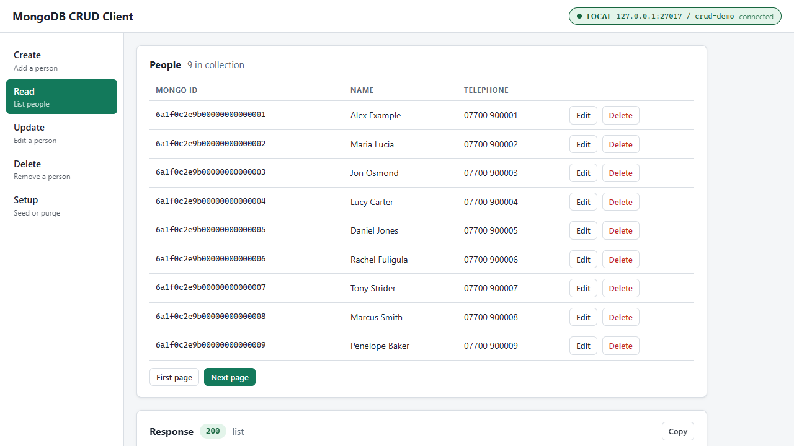
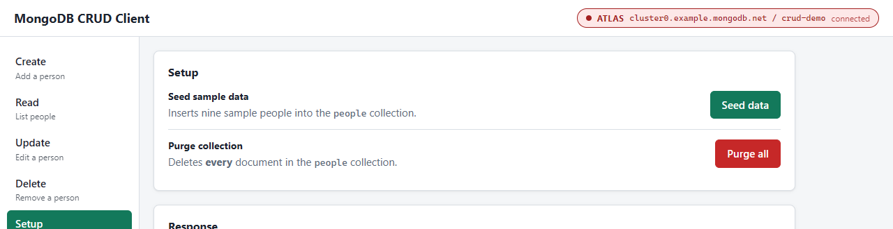
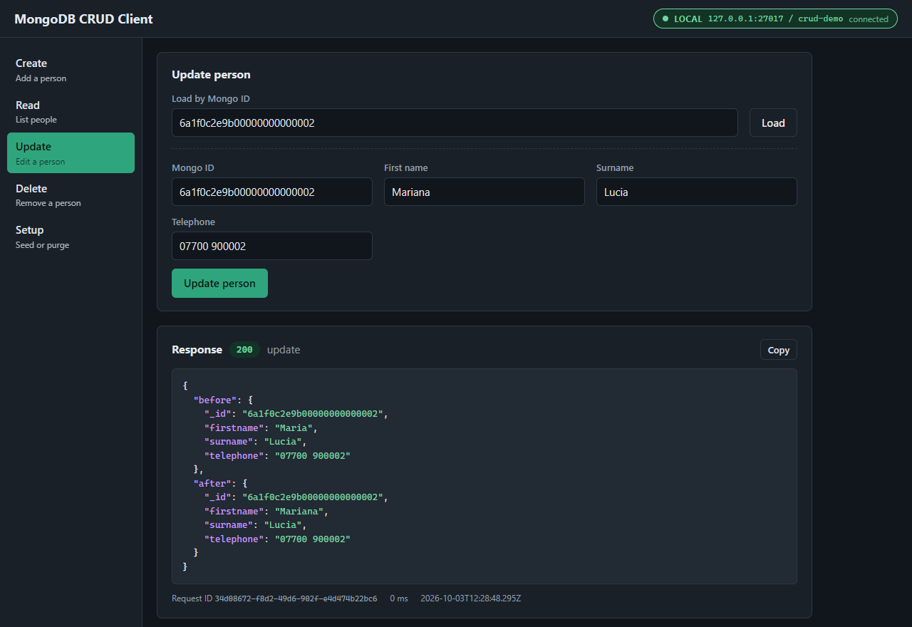
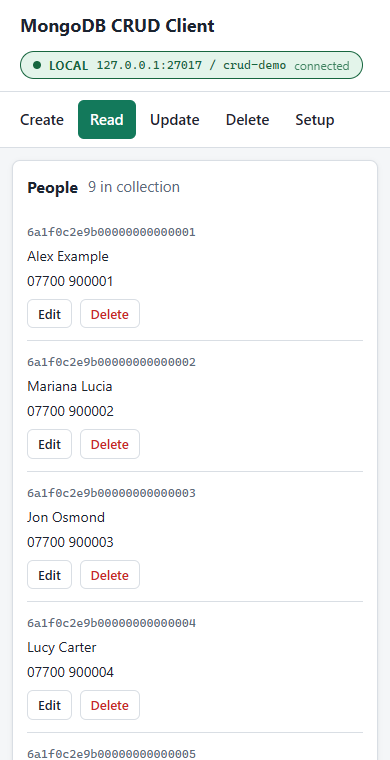
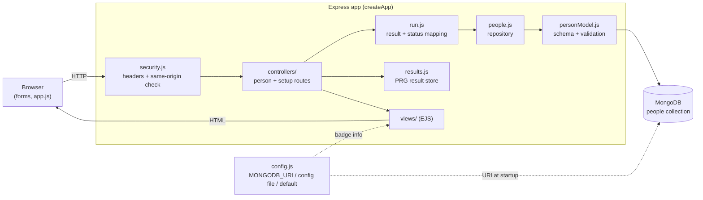
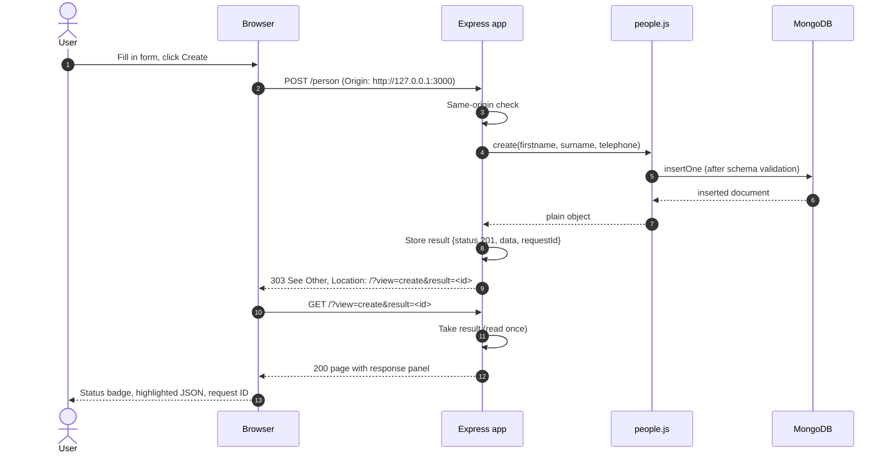

# MongoDB CRUD client (Node.js, Express, Mongoose)

A small web client that exercises MongoDB Create, Read, Update and Delete operations against a `people` collection using [Mongoose](https://mongoosejs.com/). It's a demo/learning tool, not a production app.



## What it does

| Sidebar | Operation | Route |
| --- | --- | --- |
| Create | Insert a person | `POST /person` |
| Read | List people, 10 per page (keyset pagination on `_id`) | `GET /person?after=<id>&limit=<n>` |
| Update | Load a person by Mongo ID, edit, save; shows before and after | `POST /person/update` |
| Delete | Delete a person by Mongo ID (with a confirm dialog) | `POST /person/delete` |
| Setup | Seed nine sample people, or purge the collection | `POST /person/setup`, `POST /person/purge` |

The list has Edit and Delete links per row, which pre-fill those forms from the database.

Every operation shows a response panel with the HTTP status, highlighted JSON, a copy button and a footer with a request ID (generated by the app for correlating with its logs), duration and timestamp. POSTs use post/redirect/get: the result is stored briefly and the browser is 303-redirected to `/`, so refreshing never re-submits.

The badge in the header shows which database you're pointed at and whether the app is connected:

- **green / Local**: loopback only (`localhost`, `127.0.0.1`, `::1`)
- **red / Atlas**: `mongodb+srv://` or `*.mongodb.net`, i.e. probably real data
- **amber / Custom host**: anything else



Dark mode follows your OS setting, and the layout works on narrow screens.

<p>
  
  
</p>

## Requirements

- Node.js 20.19 or later
- A MongoDB server: local install, Docker, or Atlas

## Install and run

```sh
git clone https://github.com/ajyounguk/mongodb-crud-client
cd mongodb-crud-client
npm install
npm start
```

Then open <http://127.0.0.1:3000>.

| Env var | Default | Purpose |
| --- | --- | --- |
| `MONGODB_URI` | (see below) | Connection string; overrides the config file |
| `HOST` | `127.0.0.1` | Interface to listen on |
| `PORT` | `3000` | Port to listen on |

If MongoDB is down at startup, the app keeps running, retries every 5 seconds and returns `503` for operations in the meantime.

## Connecting to MongoDB

The connection string comes from, in order:

1. the `MONGODB_URI` environment variable
2. `config/mongo-config.json`: copy `config/mongo-config-sample.json` and edit it (`"mongourl"` or `"uri"`)
3. the default, `mongodb://127.0.0.1:27017/crud-demo` (no auth)

`config/mongo-config.json` is git-ignored. Keep it that way: it's where the password lives.

The database name comes from the connection string; the collection is always `people`.

### Quick local MongoDB

The simplest option is Docker, bound to loopback only:

```sh
docker run -d --name crud-mongo -p 127.0.0.1:27017:27017 mongo:8
npm start
```

### A database user with only what the app needs

The app needs `find`, `insert`, `update` and `remove` on one database. The built-in `readWrite` role on that database is enough; don't use an admin or `dbOwner` user. In `mongosh`, as an admin:

```js
use crud-demo
db.createUser({
  user: "crud_app",
  pwd: passwordPrompt(),
  roles: [{ role: "readWrite", db: "crud-demo" }]
})
```

```json
{ "mongourl": "mongodb://crud_app:<password>@127.0.0.1:27017/crud-demo?authSource=crud-demo" }
```

### Credentials: prefer short-lived ones

A password in a JSON file is fine for a local demo. For anything real, use Atlas with one of the passwordless options, which the MongoDB driver supports in the connection string:

- **AWS IAM** (`authMechanism=MONGODB-AWS`): uses the standard AWS credential provider chain (SSO, profiles, instance or task roles), so there's no long-lived secret in the repo or on disk.
- **OIDC / workload identity** (`authMechanism=MONGODB-OIDC`)
- **X.509 client certificates**

## Security notes

- **No authentication.** Anyone who can reach the app can read, change and delete every person in the collection, including Purge all. That's why it binds to `127.0.0.1` by default. Don't set `HOST=0.0.0.0` on a network you don't control, and don't point it at a database holding data you care about.
- **CSRF.** POSTs are rejected with `403` unless the `Origin` (or, failing that, `Referer`) header matches the app's host, so a malicious page can't make your browser purge the collection. Requests with neither header (e.g. `curl`) are allowed. The app sends `Referrer-Policy: same-origin`; don't change it to `no-referrer`, or browsers send `Origin: null` and every form gets a 403.
- **Output escaping.** All data is HTML-escaped in templates, and the JSON highlighter builds DOM nodes with `textContent`. A strict Content-Security-Policy (`default-src 'self'`, no inline script) is set as a second layer.
- **Query injection.** Only `firstname`, `surname` and `telephone` are taken from form bodies, always as strings; IDs must be valid ObjectIds; Mongoose `sanitizeFilter` is on.
- **Errors.** Error responses show the error name, message and MongoDB code with any `user:password@` in URIs masked. The connection string itself is never logged or rendered.
- **History.** An early version of this repo committed a local development MongoDB connection string with a password (2018). It's still in the git history and in forks. It was for a local-only test database, but if you ever reused that password anywhere, change it.

## Tests

```sh
npm test
```

Uses `node:test` and `supertest`. Route tests inject a fake repository; repository tests and one end-to-end test run against a throwaway `mongod` started by [mongodb-memory-server](https://github.com/typegoose/mongodb-memory-server) on a random loopback port. The first run downloads a MongoDB binary into `node_modules/.cache/mongodb-binaries`.

## Project layout

```
app.js                    createApp() factory; connects and listens only when run directly
lib/config.js             connection string loading, badge description, credential redaction
lib/people.js             data access (the only code that talks to Mongoose)
lib/errors.js             maps Mongoose/driver errors to HTTP statuses
lib/run.js                runs one operation and packages the result for the response panel
lib/results.js            short-lived store for post/redirect/get results
lib/security.js           security headers and same-origin check
controllers/              routes (CRUD, seed/purge)
models/personModel.js     Person schema and validation
views/                    EJS templates (index.ejs + partials/)
public/                   stylesheet and client script
test/                     node:test suites
```

## Architecture



A create, end to end:



## More info

- MongoDB: <https://www.mongodb.com/docs/>
- Mongoose: <https://mongoosejs.com/docs/>
- Express: <https://expressjs.com/>
